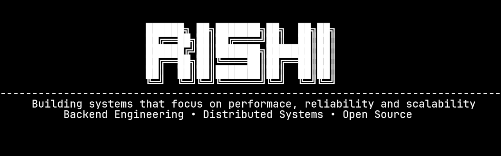

---

## 🧠 Who I Am

I'm a Computer Science student focused on **backend engineering and system design**.

I care about how systems **behave under load**, **scale across environments**, and **stay reliable in production**.

I’m less interested in surface-level features — more in the **architecture underneath**.

---

### 🔭 Focus

- Backend systems and API design  
- Distributed systems and service architecture  
- Performance, reliability, and scalability  
- Infrastructure and deployment workflows  

---

### ⚙️ What I’m Building Toward

- Production-grade backend systems  
- Developer tools and infrastructure software  
- Scalable services that solve real-world problems  

---

### 🧩 Current Stack

- **Languages:** Go, Python, Shell, SQL
- **Backend:** FastAPI, REST/gRPC services  
- **Infra:** Docker, Podman, Vercel, Linux, Github Actions  
- **Databases:** SQLite, PostgreSQL  

---

## 🧰 Tech Stack

### Languages

  
  
  

### Infrastructure & DevOps

  
  
  
  
  

### Data & Systems

  
  

---

## 📊 GitHub Insights

  
   
   
  

---

## 💬 Let’s Connect

  
  

---

  <i>"Good systems aren’t just built — they’re designed to survive."</i>

